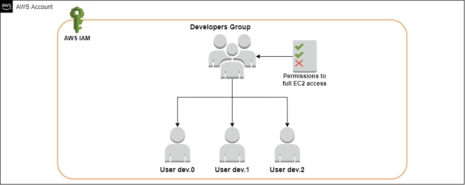
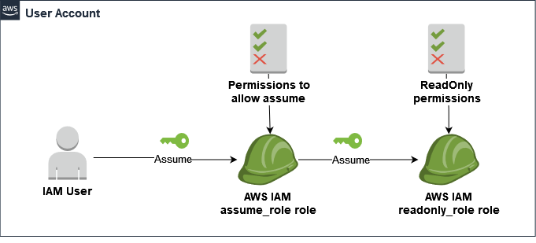
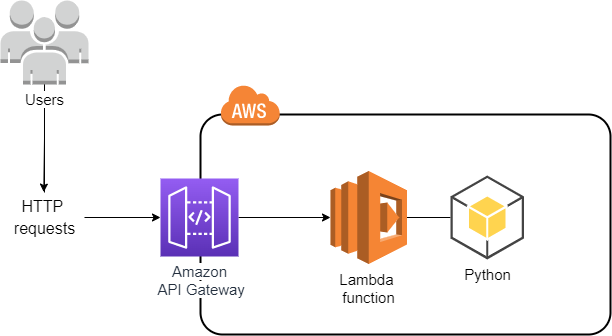

# Task 1 - Create and Configure a Custom Administrator User
## Lab Description
The goal of this task is to create and configure a custom IAM user with Administrator privileges, Multi-Factor Authentication (MFA), and programmatic access to AWS.

## Task Resources
In this task you will work with the following resource:

**IAM User `${aws_iam_user}`**
## Objectives
In four moves, you must:

Create a new IAM user with the username `${aws_iam_user}`.
Grant Administrator privileges to the new user. Please, use existing AWS policy and do not create your own.
Configure MFA for the user. Use only the "Passkey or security key" or "Authenticator app" Device options.
Generate a pair of access keys for programmatic access via the AWS CLI.
One "move" is the creation, update, or deletion of an AWS resource. Some verification steps may pass without taking any action, but to complete the task you must ensure that all the steps are passed.

## Task Verification
To verify that everything has been done correctly, you can log in to the AWS Management Console as the newly created user `${aws_iam_user}`. Next, execute any command that requires administrative access; it should be successful.

## Deployment Time
It should take about 2 minutes to deploy the task resources.

## Sandbox User Credentials
Use the credentials below to access the AWS environment:

## AWS Console
Console URL: `${console_url}`
IAM username: `${iam_user}`
Password: `${user_password}`
## AWS environment variables
AWS_ACCESS_KEY_ID=`${access_key_id}`
AWS_SECRET_ACCESS_KEY=`${secret_access_key}`
Access is granted for 2,5 hours, from `${task_start_time}` to `${task_end_time}` (UTC).
After the access period ends, all resources will be automatically deleted.

# Task 2 - Create an AWS Billing Alarm and Configure It to Send Email Notification via SNS Topic
## Lab Description
The goal of this task is to create a CloudWatch billing alarm that sends billing notifications through an SNS topic.

## Task Resources
Region-specific resources must be created in the `${aws_region}` region. For more details about regional services, see AWS Services by Region.

### In this task, you will work with the following resources:

SNS Topic `${sns_topic__: An SNS topic with an email subscription for billing notifications.
CloudWatch Alarm `${alarm name__: A CloudWatch alarm that triggers based on billing thresholds.
## Objectives
In this task, you need to:

Create an AWS SNS topic `${sns_topic__.
Create an email subscription for the SNS topic.
Enable billing alerts for the AWS account. (this step is already completed because the task is running in a sandbox environment)
Create a CloudWatch billing alarm `${alarm_name}` that monitors your billing metrics.
## Task Verification
To verify that you have successfully completed the task:

The SNS topic `${sns_topic}` exists and has the email subscription configured.
Billing alerts are enabled for your account. (this step is already completed because the task is running in a sandbox environment)
The CloudWatch alarm `${alarm_name}` is correctly set up and monitoring billing metrics.
Deployment Time
It should take about 5 minutes to deploy the task resources.

## Sandbox User Credentials
Use the credentials below to access the AWS environment:

## AWS Console
Console URL: `${console_url}`
IAM username: `${iam_user}`
Password: `${user_password}`
## AWS environment variables
AWS_ACCESS_KEY_ID=`${access_key_id}`
AWS_SECRET_ACCESS_KEY=`${secret_access_key}`
Access is granted for 2,5 hours, from `${task_start_time}` to `${task_end_time}` (UTC).
After the access period ends, all resources will be automatically deleted.

# Task 3 - Configuring the IAM Group Permissions

## Lab Description
The goal of this task is to configure required permissions for a given user group and verify that users within this group have inherited these permissions.

See the following diagram for an overview of the lab:

## Task Resources
Region-specific resources are created in the `${aws_region}` region. For more details about regional services, see AWS Services by Region.

## In this task, you should work with the following resources:

IAM Group `${group_developers}`: An IAM user group.
IAM Users `${user_dev_0}`, `${user_dev_1}`, and `${user_dev_2}`: These users are added to the `${group_developers}` group.
Objectives
In one move, you must grant the correct permissions to the `${group_developers}` group so that each user in the group has full access to the EC2 service. Use an AWS-managed policy and follow the principle of least privilege. Do not create your own policy.

One "move" is the creation, updating, or deletion of an AWS resource. Some validation steps may pass without any action, but to complete the task, you must ensure that all steps are passed.

## Task Verification
To make sure everything has been done correctly, you can create a console password for one of the users, sign in as this user, and verify that the `${group_developers}` group has full access to the EC2 service.

## Deployment Time
It should take about 2 minutes to deploy the task resources.

## Sandbox User Credentials
Use the credentials below to access the AWS environment:

### AWS Console
Console URL: `${console_url}`
IAM username: `${iam_user}`
Password: `${user_password}`
### AWS environment variables
AWS_ACCESS_KEY_ID=`${access_key_id}`
AWS_SECRET_ACCESS_KEY=`${secret_access_key}`
Access is granted for 2,5 hours, from `${task_start_time}` to `${task_end_time}` (UTC).
After the access period ends, all resources will be automatically deleted.

# Task 4 - Configuration of Role Chaining in AWS

## Lab Description
The goal of this task is to configure role chaining using two roles, allowing one dedicated role to assume another role with read-only access.

Examine the architecture below:

## Task Resources
Region-specific resources are created in the `${aws_region}` region. For more details about regional services, see AWS Services by Region.

The following roles have been created for you:

Assume Role `${assume_role}`: This role should be assumed by any user in your AWS account.
Read-Only Role `${readonly_role}`: This role should be assumed only by the `${assume_role}` role.
## Objectives
Your task is to:

Configure proper permissions for the `${assume_role}` role, allowing it to assume the `${readonly_role}` role. Do not grant full administrator access!
Grant full read-only access for the `${readonly_role}` role. Please use an existing AWS policy; do not create your own.
Configure the correct trust policy for the `${readonly_role}` role to allow it to be assumed by the `${assume_role}` role.
One "move" is the creation, updating, or deletion of an AWS resource. Some verification steps may pass without any action, but to complete the task, you must ensure that all the steps are passed.

## Task Verification
To make sure everything is set up correctly, use the AWS policy simulator for the roles and check that:

The `${assume_role}` role can assume other roles.
The `${readonly_role}` role can perform read-only actions and is not allowed to perform write actions.
Optionally: Instead of using the AWS policy simulator, you can assume the`${assume_role}` role and then assume the `${readonly_role}` role with this role. Next, try to execute any command that requires read-only access; it should be successful. Then, try to execute a command that requires write access; it should return an error message.

## Deployment Time
It takes up to 2 minutes to deploy task resources.

## Sandbox User Credentials
Use the credentials below to access the AWS environment:

### AWS Console
Console URL: `${console_url}`
IAM username: `${iam_user}`
Password: `${user_password}`
### AWS environment variables
AWS_ACCESS_KEY_ID=`${access_key_id}`
AWS_SECRET_ACCESS_KEY=`${secret_access_key}`
Access is granted for 2,5 hours, from `${task_start_time}` to `${task_end_time}` (UTC).
After the access period ends, all resources will be automatically deleted.

# Task 5 - Using AWS Managed Policies for IAM Resources

# Lab Description
The goal of this task is to configure two IAM roles by attaching AWS managed policies.

## Task Resources
Region-specific resources are created in the `${aws_region}` region. For more details about regional services, see AWS Services by Region.

In this task, you will work with the following resources:

Read-Only Role: `${iam_role_readonly}`: This role will have read-only access to AWS resources.
Administrator Role: `${iam_role_administrator}`: This role will have full administrative access to AWS resources.
## Objectives
In two moves, you must grant access for each role according to their names by using AWS managed policies. Please use existing AWS policies and do not create your own.

One "move" is the creation, updating, or deletion of an AWS resource. Some validation steps may pass without any action, but to complete the task, you must ensure that all steps are passed.

## Deployment Time
It should take about 1 minutes to deploy the task resources.

## Sandbox User Credentials
Use the credentials below to access the AWS environment:

### AWS Console
Console URL: `${console_url}`
IAM username: `${iam_user}`
Password: `${user_password}`
### AWS environment variables
AWS_ACCESS_KEY_ID=`${access_key_id}`
AWS_SECRET_ACCESS_KEY=`${secret_access_key}`
Access is granted for 2,5 hours, from `${task_start_time}` to`${task_end_time}` (UTC).
After the access period ends, all resources will be automatically deleted.

# Task 6 - Configuring IAM Policies With Conditions 
## Lab Description
The goals of this task are to explore and configure IAM policies with conditions for a given IAM instance profile and test it on an EC2 instance.

## Task Resources
Region-specific resources are created in the `${aws_region}` region. For more details about regional services, see AWS Services by Region.

In this task, you will work with the following resources:

EC2 Instance `${instance}`: This instance has an IAM instance profile `${instance_profile}` attached to it.
IAM Instance Profile `${instance_profile}`: This profile has an IAM role `${iam_role}` attached to it.
IAM Role `${iam_role}`: You must attach all necessary permissions to this role. Note that it has a predefined set of permissions, which should not be modified.
S3 Bucket `${bucket}`: Use this bucket to test your configuration.
## Objectives
In two moves, you must configure two additional inline policies for the instance profile:

The first policy, named `${deny_s3_policy}`, should deny all Get and List actions on the S3 bucket service when the request originates from the public IP address of the EC2 instance.
The second policy, named `${deny_ec2_policy}`, should deny all Describe actions on the EC2 service when the request originates from the eu-west-1 region.
One "move" is the creation, updating, or deletion of an AWS resource. Some validation steps may pass without any action, but to complete the task, you must ensure that all steps are passed.

## Task Verification
To verify your configuration, log in to the `${instance}` EC2 instance via Session Manager or EC2 Instance Connect and check your settings.

## Deployment Time
It should take about 2 minutes to deploy the task resources.

## Sandbox User Credentials
Use the credentials below to access the AWS environment:

### AWS Console
Console URL: `${console_url}`
IAM username: `${iam_user}`
Password: `${user_password}`
### AWS environment variables
AWS_ACCESS_KEY_ID=`${access_key_id}`
AWS_SECRET_ACCESS_KEY=`${secret_access_key}`
Access is granted for 2,5 hours, from `${task_start_time}` to `${task_end_time}` (UTC).
After the access period ends, all resources will be automatically deleted.

# Task 7 - IAM Inline and Managed Policies
## Lab Description
The goal of this task is to learn how to use customer-managed policies and inline policies.

## Task Resources
Region-specific resources are created in the `${aws_region}` region. For more details about regional services, see AWS Services by Region.

In this task, you will work with the following resources:

IAM User: `${user}`
Customer Managed Policy: `${policy_managed}`
IAM Roles: `${role_managed}` and `${role_inline}`
The managed policy `${policy_managed}` must have the following permissions:

Assume role (this permission is granted by default)
-   List all S3 buckets
-   List all content in the S3 bucket
-   List all roles
-   List all users
The inline policy for the `${role_inline}` role must have the following permissions:

-   List all S3 buckets
-   List all content in the S3 bucket
## Objectives
In four moves, you must:

-   Configure the managed policy $`{policy_managed}`.
-   Attach the managed policy `${policy_managed}` to the IAM user`${user}`.
-   Attach the managed policy `${policy_managed}` to the IAM role `${role_managed}`.
-   Create an inline policy for the IAM role `${role_inline}`.

One "move" is the creation, updating, or deletion of an AWS resource. Some validation steps may pass without any action, but to complete the task, you must ensure that all steps are passed.

## Deployment Time
It should take about 2 minutes to deploy the task resources.

## Sandbox User Credentials
Use the credentials below to access the AWS environment:

### AWS Console
-   Console URL: `${console_url}`
-   IAM username: `${iam_user}`
-   Password: `${user_password}`
### AWS environment variables
-   AWS_ACCESS_KEY_ID=`${access_key_id}`
-   AWS_SECRET_ACCESS_KEY=`${secret_access_key}`
-   Access is granted for 2,5 hours, from `${task_start_time}` to `${task_end_time}` (UTC).  
After the access period ends, all resources will be automatically deleted.

# Task 8 - Policy Evaluation Logic (Deny)
## Lab Description
The goal of this task is to explore the process of evaluating policies and to configure both identity-based policy and resource-based policy for a specific role.

## Task Resources
Region-specific resources are created in the `${aws_region}` region. For more details about regional services, see AWS Services by Region.

In this task, you will work with the following resources:

-   IAM Role `${iam_role}`: You will grant specific permissions for this role and check to make sure they are applied successfully.
-   S3 Bucket `${s3_bucket}`: A bucket with an existing policy.
## Objectives
In two moves, you must:

-   Grant full access to the Amazon S3 service for the `${iam_role}` role. Please use an existing AWS policy; do not create your own.
-   Update the resource-based S3 bucket policy to prohibit the deletion of any objects inside the `${s3_bucket}` bucket specifically for the `${iam_role}` role.
-   One move is to create, update, or delete an AWS resource. Some verification steps may pass without any action, but to complete the task, you must ensure that all the steps are passed.

## Task Verification
To ensure everything has been done correctly, use the policy simulator for the `${iam_role}` role and check to make sure you cannot delete objects in the `${s3_bucket}` bucket.

## Deployment Time
It should take about 2 minutes to deploy the task resources.

## Sandbox User Credentials
Use the credentials below to access the AWS environment:

### AWS Console
-   Console URL: `${console_url}`
-   IAM username: `${iam_user}`
-   Password: `${user_password}`
### AWS environment variables
-   AWS_ACCESS_KEY_ID=`${access_key_id}`
-   AWS_SECRET_ACCESS_KEY=`${secret_access_key}`
-   Access is granted for 2,5 hours, from `${task_start_time}` to `${task_end_time}` (UTC). 

After the access period ends, all resources will be automatically deleted.

# Task 9 - Policy Evaluation Logic (Allow)

## Lab Description
The goals of this task are to explore the process of evaluating policies and to configure both an identity-based policy and a resource-based policy for a specific role.

## Task Resources
Region-specific resources are created in the `${aws_region}` region. For more details about regional services, see AWS Services by Region.

In this task, you will work with the following resources:

-   IAM Role `${iam_role}`: You will grant specific permissions to this role and verify that they are applied successfully.
-   S3 Bucket `${s3_bucket}`: A bucket with a default configuration and one object inside. A resource-based S3 bucket policy should be created for this bucket.
-   S3 Bucket `${s3_default_bucket}`: An empty bucket used solely for task verification purposes. Do not attach any policies to this bucket or change its configuration.
## Objectives
In two moves, you must:

-   Create and attach an inline identity-based policy to the `${iam_role}` role that allows all buckets to be listed.
-   Create a resource-based S3 bucket policy that allows to get and put an object as well as list the objects in the `${s3_bucket}` bucket. The `${iam_role}` role must be allowed to perform all of these actions for the `${s3_bucket}` bucket only; do not allow access to all principals.
-   One move is to create, update, or delete an AWS resource. Some verification steps may pass without any action, but to complete the task, you must ensure that all the steps are passed.

## Task Verification
To make sure everything has been done correctly, use the AWS policy simulator for the `${iam_role}` role and check that:

-   You can list all the buckets.
-   You can list, get, and put objects only in the `${s3_bucket}` bucket.
-   You can't list, get, or put objects in the `${s3_default_bucket}` bucket.
-   Optionally: Instead of using the AWS policy simulator, you can assume the role and perform the required checks.

## Deployment Time
It should take about 2 minutes to deploy the task resources.

## Sandbox User Credentials
Use the credentials below to access the AWS environment:

### AWS Console
-   Console URL: `${console_url}`
-   IAM username: `${iam_user}`
-   Password: `${user_password}`
### AWS environment variables
-   AWS_ACCESS_KEY_ID=${access_key_id}
-   AWS_SECRET_ACCESS_KEY=${secret_access_key}
-   Access is granted for 2,5 hours, from `${task_start_time}` to `${task_end_time}` (UTC).

After the access period ends, all resources will be automatically deleted.

# Task 10 - Using AWS Lambda Function with API Gateway

## Lab Description
The goal of this task is to grant the correct permissions to a Lambda function so that it can access the necessary resources and other resources can access it as well.

Examine the architecture below:

## Task Resources
Region-specific resources are created in the `${aws_region}` region. For more details about regional services, see AWS Services by Region.

In this task, you will work with the following resources:

-   Lambda function `${lambda_function}: Returns a list of Lambda functions in the AWS account. This function has an execution role `${iam_role}` and a resource-based policy and serves as the HTTP API back end.
-   Lambda execution role `${iam_role}.
-   API Gateway `${apigatewayv2_api}: An HTTP API integrated with the `${lambda_function}` function.
## Objectives
You must achieve the following objectives in two moves:

-   Grant the correct permissions to the Lambda function so it can access the resources it needs based on the function code. Use the AWS managed policy that grants access to Lambda API actions, and follow the principle of least privilege. Please use the existing AWS policy; do not create your own.
-   Grant the correct permissions to the Lambda function so that the HTTP API can invoke it.
-   One move is to create, update, or delete an AWS resource. Some verification steps may pass without any action being applied, but to complete the task you must ensure that all the steps are passed.

## Task Verification
To make sure everything is set up correctly, test your API by using a web-browser to invoke it.

## Deployment Time
It should take about 2 minutes to deploy the task resources.

## Sandbox User Credentials
Use the credentials below to access the AWS environment:

### AWS Console
-   Console URL: `${console_url}
-   IAM username: `${iam_user}
-   Password: `${user_password}
### AWS environment variables
-   AWS_ACCESS_KEY_ID=${access_key_id}
-   AWS_SECRET_ACCESS_KEY=${secret_access_key}
-   Access is granted for 2,5 hours, from `${task_start_time}` to `${task_end_time}` (UTC).

- After the access period ends, all resources will be automatically deleted.

# Task 11 - Protecting Data in S3 Using an AWS KMS Customer Managed Key

## Lab Description
The goal of this task is to encrypt the contents of an S3 bucket using a KMS key automatically created in your account and to add a new object to the encrypted bucket. An IAM role must also be configured to work with the KMS key.

## Task Resources
Region-specific resources are created in the `${aws_region}` region. For more details about regional services, see AWS Services by Region.

In this task, you should work with the following resources:

IAM Role `${iam_role}: A role with full access to IAM and S3 services. CloudMentor will assume this role during the task validation.
S3 Buckets `${s3_bucket_1}` and `${s3_bucket_2}: The first bucket contains an object, which you need to copy to the second bucket.
KMS Key `${kms_key_arn}: This key can only be used to encrypt objects in the second bucket; encrypting objects and the bucket itself with other keys is prohibited.
## Objectives
In three moves, you must:

-   Grant all the necessary permissions for the ${iam_role} role to work with the key. Do not grant full administrator access! 
-   Enable server-side encryption for the `${s3_bucket_2}` bucket using the AWS KMS key with the `${kms_key_arn}` ARN.
-   Check to make sure you can put a new encrypted object in the encrypted bucket. To do this, copy the confidential_credentials.csv file from the `${s3_bucket_1}` bucket to the `${s3_bucket_2}` bucket using AWS CLI or by downloading an object from `${s3_bucket_1}` and uploading it to `${s3_bucket_2}. As a result, the copied file confidential_credentials.csv should be encrypted.
-   One move is to create, update, or delete an AWS resource. Some verification steps may pass without any action being applied, but to complete the task you must ensure that all the steps are passed.

## Deployment Time
It should take about 2 minutes to deploy the task resources.

## Sandbox User Credentials
Use the credentials below to access the AWS environment:

### AWS Console
-   Console URL: `${console_url}
-   IAM username: `${iam_user}
-   Password: `${user_password}
### AWS environment variables
-   AWS_ACCESS_KEY_ID=${access_key_id}
-   AWS_SECRET_ACCESS_KEY=${secret_access_key}
-   Access is granted for 2,5 hours, from `${task_start_time}` to `${task_end_time}` (UTC).

After the access period ends, all resources will be automatically deleted.